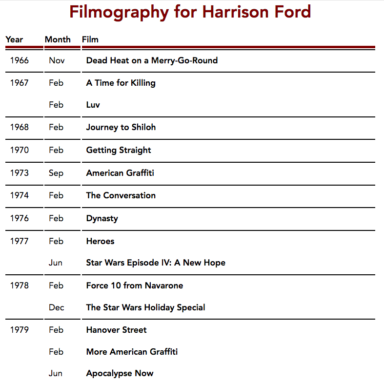
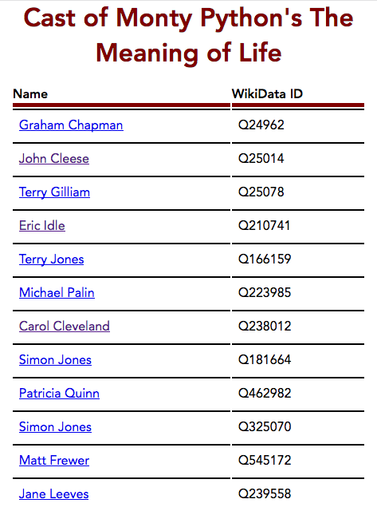

Filmography Finder
==================

This is a simple Node.js/express app to find the filmographies of Actors using WikiData and SparQL queries.

Lookup Filmography of an Artist
===============================



Endpoint is

```
/filmography/:actor_name
```

--------

Looking up cast of a film
=========================

Note that the lookup is case sensitive, and needs to match EXACTLY the name as shown on Wikipedia/Wikidata. You might need to copy and paste from Wikipedia to be sure, especially for films with complex titles like the Star Wars movies :)



endpoint is

```
/cast/:filmName
```

---------

Installation
============

Clone to a project directory, cd into that directory then

```
npm install
npm start
```

You should now be able to use the following URL in the browser window

```
localhost:3000/filmography/Carrie Fisher
```


---------

Notes / Caveats
===============

This uses lookups to WikiData. The data may not be complete or up-to-date with Wikipedia itself. For example, some newer films will not have data yet.

This app will not replace IMDB any time soon :-D
